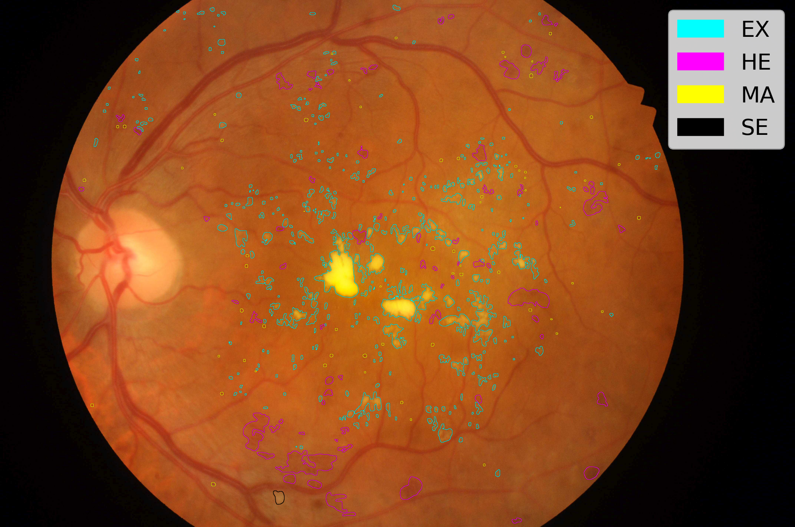

# Mask Overlay

Simple application to overlay a mask's outline onto an image.

Example usage:

```shell
python main.py img/image.jpg img/mask_1.tif img/mask_2.tif img/mask_3.tif img/mask_4.tif \
       --labels "EX" "HE" "MA" "SE" \ 
       --colours "#00ffff" "#ff00ff" "#ffff00" "#000000" \
       --dpi 400 
```

Which yields:

